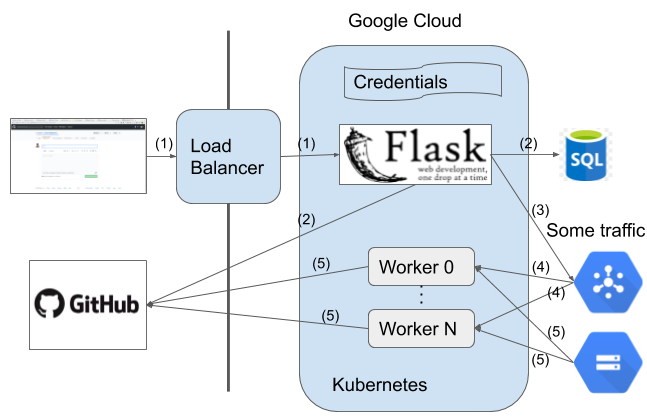

# Repo-Specific Label Microservice

There is an [issue label bot](https://mlbot.net) on GitHub, which can generate three types of labels, bug, feature and question, to new issues.
We would like to build a new label microservice that can predict repo-specific labels for different repositories.
This folder contains the service that receives an issue as input and returns repo-specific label predictions.

## Summary

We would like to integrate the whole services and there are two services now.

1. The flask app produces three types of labels, bug, feature and question, for all repositories.

1. The repo-specific label microservice (in this folder) generates repo-specific labels according to repositories.

We plan to roll out the repo-specific label microservice gradually instead of replacing the existing flask app with the new service directly.
Therefore, we would randomly select a proportion of issues from the specified repositories and send them to the new repo-specific service.

The design of our rollout strategy is shown as the following diagram.

### Steps

The original bot includes step 1 and step 2.
If the flask app forwards traffic to the new service, the workers for the microservice will do repo-specific label predictions.
The following describes the steps (the numbers) in the diagram.

1. When an issue is filed, the GitHub payload will be sent to the flask app.

1. If the issue is not selected, the flask app will predict one of three types of labels and add the label to the issue.

1. If the issue is selected, the flask app will forward the GitHub event to Cloud Pub/Sub and not do label predictions.

1. There is a pool of workers listening to Cloud Pub/Sub and they take one item in Cloud Pub/Sub every time.

1. Workers load the specific models from Google Cloud Storage and do repo-specific predictions.

## Project Settings

We have two services now, the flask app for the original bot and the repo-specific label microservice.
They can be in different GCP projects.
We also create a staging cluster to run the whole services for testing.
The following describes the GCP projects and clusters where the two services are running respectively.

### Production

1. The flask app
    - **repository**: [machine-learning-apps/Issue-Label-Bot](https://github.com/machine-learning-apps/Issue-Label-Bot)
    - **GCP project**: github-probots
    - **cluster**: kf-ci-ml
    - **namespace**: mlapp

1. Repo-specific label microservice
    - **repository**: [kubeflow/code-intelligence](https://github.com/kubeflow/code-intelligence/tree/master/Label_Microservice)
    - **GCP project**: issue-label-bot-dev
    - **cluster**: workers
    - **namespace**: default

### Testing

1. The flask app
    - **repository**: [machine-learning-apps/Issue-Label-Bot](https://github.com/machine-learning-apps/Issue-Label-Bot)
    - **GCP project**: issue-label-bot-dev
    - **cluster**: github-mlapp-test
    - **namespace**: mlapp

1. Repo-specific label microservice
    - **repository**: [kubeflow/code-intelligence](https://github.com/kubeflow/code-intelligence/tree/master/Label_Microservice)
    - **GCP project**: issue-label-bot-dev
    - **cluster**: github-mlapp-test
    - **namespace**: default
